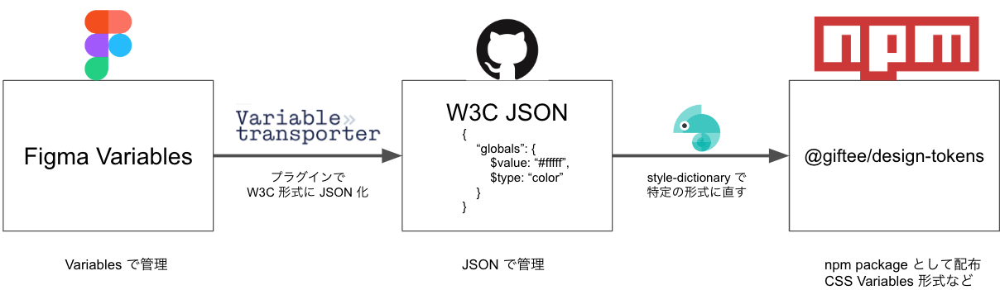
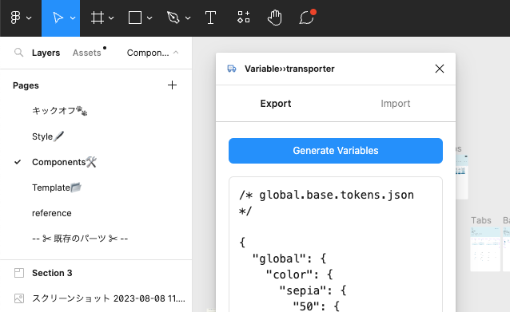

# 開発

@giftee/abukuma-design-tokens の開発用の README です。
どんな形であれ、貢献していただけるととても助かります 🙇

## セットアップ

```bash
$ pnpm install
$ pnpm build
# dist に結果ができます
```

## Figma <=> Npm package の流れ



1. Figma の [Variables](https://help.figma.com/hc/ja/articles/15339657135383-Figma%E3%81%A7%E3%81%AE%E3%83%90%E3%83%AA%E3%82%A2%E3%83%96%E3%83%AB%E3%81%AB%E9%96%A2%E3%81%99%E3%82%8B%E3%82%AC%E3%82%A4%E3%83%89) でデザイントークンを管理
2. Figma の [Variables>>transporter](https://www.figma.com/community/plugin/1261261815164515762/variabletransporter) プラグインで、Variables を [W3C 形式](https://tr.designtokens.org/format/) の JSON format に export
3. export したものを本ディレクトリの `/tokens`に配置
4. [style-dictionary](https://amzn.github.io/style-dictionary/#/) で CSS variables などの形式に整形し npm package として配布

### Figma から W3C 形式で export



[Variables>>transporter](https://www.figma.com/community/plugin/1261261815164515762/variabletransporter) を起動し、Generate するだけです。Generate したファイルは Collection と Mode ごとになっています。

### tokens ディレクトリに格納

Generate した JSON は以下のようになっています。それらを以下のようにコピーしてください。（そのうち自動連携したいです）

- global.base.tokens.json → `tokens/globals/index.tokens.json`
- semantic-theme.marine-light.tokens.json → `tokens/semantics/brands/marine-light/index.tokens.json`
- semantic-theme.marine-dark.tokens.json → `tokens/semantics/brands/marine-dark/index.tokens.json`
- semantic-theme.skeleton-light.tokens.json → `tokens/semantics/brands/skeleton-light/index.tokens.json`
- semantic-theme.coral-light.tokens.json → `tokens/semantics/brands/coral-light/index.tokens.json`
- semantic-common.base.tokens.json → `tokens/semantics/common/index.tokens.json`

```json
/* global.base.tokens.json */
{
  "global": {
    "color": {
      "50": {
        "$type": "color",
        "$value": "#ffffff"
      }
    }
  }
}

/* semantic-theme.marine-light.tokens.json */
{
  "semantic": {
    "color": {
      "text": {
        "default": {
          "$type": "color",
          "$value": "{global.color.steel.600}"
        }
      }
    }
  }
}
/* semantic-theme.marine-dark.tokens.json */
{
  "semantic": {
    "color": {
      "text": {
        "default": {
          "$type": "color",
          "$value": "{global.color.white.800}"
        }
      }
    }
  }
}
/* semantic-theme.skeleton-light.tokens.json */
{
  "semantic": {
    "color": {
      "text": {
        "default": {
          "$type": "color",
          "$value": "{global.color.slate.600}"
        }
      }
    }
  }
}
/* semantic-common.base.tokens.json */
{
  "semantic": {
    "icon": {
      "size-medium": {
        "$type": "number",
        "$value": "{global.size.2000}"
      }
    }
  }
}
```

### Build

コピーした状態で `pnpm build` すると、CSS Variables などの形式で吐き出されます。

```bash
$ pnpm build
```

## 開発フロー

1. Figma Variables を編集
2. Variables>>transporter でエクスポートし、`tokens` ディレクトリにコピー
3. `pnpm build` で適切に確認
4. commit 前にレポジトリのルートで `pnpm changeset` を打つ
5. PR 作成/マージ
